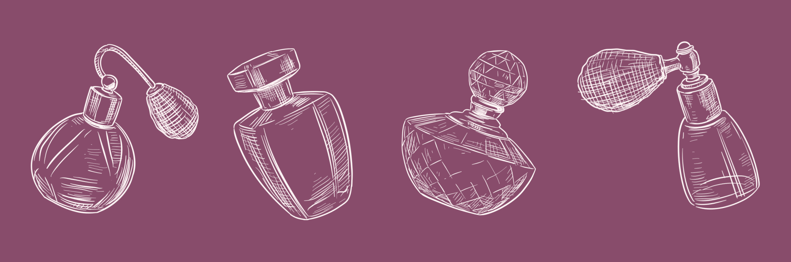

<div align="center">

# L'aura Du Parfum

<br>
<br>
</div>
<p align="center">
  
</p>
<br>
<br>

**L’aura du Parfum** is a two-part machine learning model that will predict the main accords of a fragrance and list related fragrances from user input.

**Problem Statement**: Predict the main accords of a fragrance based on its notes and list related fragrances based on user input.

**About the Data Set**:  Our dataset includes 43,733 fragrance entries from the Kaggle Dataset, [Fragrantica.com Fragrance Dataset](https://www.kaggle.com/datasets/olgagmiufana1/fragrantica-com-fragrance-dataset), by user Olga G (miufana1), with categorical data about their Name, Rating value, Gender, Top Notes, Middle Notes, Base Notes, and Accords.

**Our Solution**: To predict the accords of a fragrance, we used a One-vs-Rest (OVR) Classifier with XGBoost (Extreme Gradient Boosting) model as a parameter and MLSMOTE (Multi-Label Synthetic Minority Over-sampling Technique) to address accord class imbalance in our dataset. To list related fragrances from user input, we used UMAP (Uniform Manifold Approximation and Projection) for dimensionality reduction and HDBSCAN (Hierarchical Density-Based Spatial Clustering of Applications with Noise) for clustering, followed by a custom similarity engine based on notes, accords, and gender.


**Impact**: Our impact of our project is to streamline the research process when it comes to picking and reviewing fragrances.

## Preparing environment:

### To continue with a virtual environment \(.venv\)
- Should have the latest Python installed or Python >= 3.4
- In terminal you will type out `python -m venv name_of_your_venv` (I suggest using a file that starts with a '.' to avoid git adding it to your commits and pushes)

### Downloading Packages
Run `pip install -r requirements.txt`
## Dataset download

### Option 1 - manually download
- Head to the kaggle dataset -- https://www.kaggle.com/datasets/olgagmiufana1/fragrantica-com-fragrance-dataset?select=fra_cleaned.csv
- Click the download and look down until you see "Download dataset as zip."
- Unzip file into `Data` directory
### Option 2 - CLI
#### Prerequisites
- Log in to your Kaggle account
- Go to **Account** settings
- Scroll down to the "API" section 
- Select create Legacy API key, which will download a "kaggle.json" file
- In the terminal 
  - `mkdir -p ~/.kaggle`
  - `mv /path/to/downloaded/kaggle.json ~/.kaggle`
  - `chmod 600 ~/.kaggle/kaggle.json`
#### Downloading the files
- Once more into the terminal you will now type in:
  - `cd Data`
  - `kaggle datasets download olgagmiufana1/fragrantica-com-fragrance-dataset`
- To automatically unzip the files add `--unzip` to the end of it.

## Interact With Our Models and Results 
Our project contains two parts that address our problem statement: ```classification_interactive.ipynb``` and ```cluster_interactive.ipynb```:

Run **Accord Classification** Notebook:

```
jupyter notebook classification_interactive.ipynb
```

Run **Fragrance Clustering & Recommendation** Notebook:

```
jupyter notebook cluster_interactive.ipynb
```

# More Information:

For more information about how we cleaned our dataset and custom clustering method please visit [here](./more_information.md).
